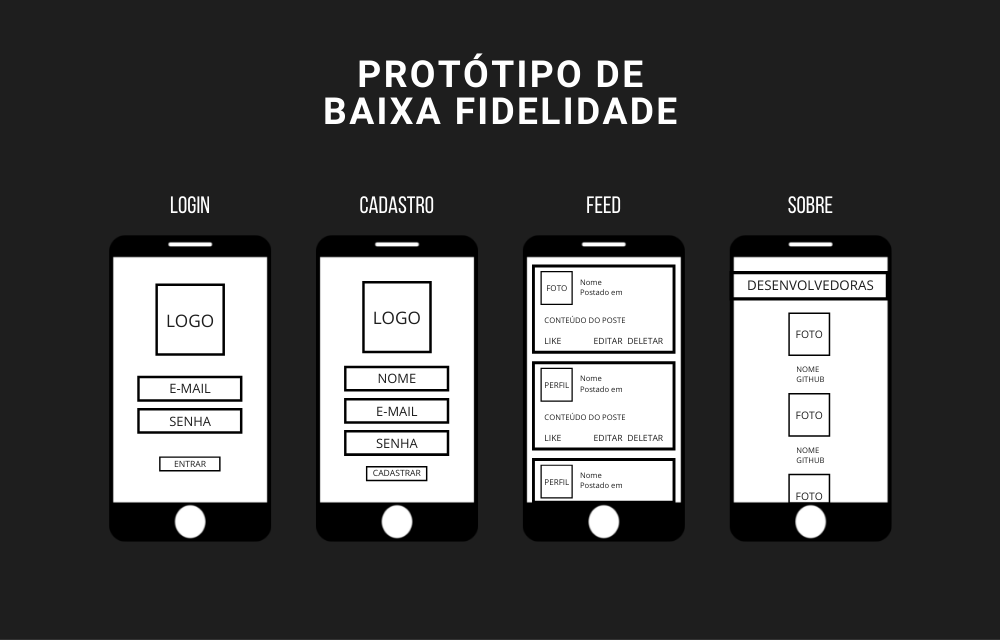
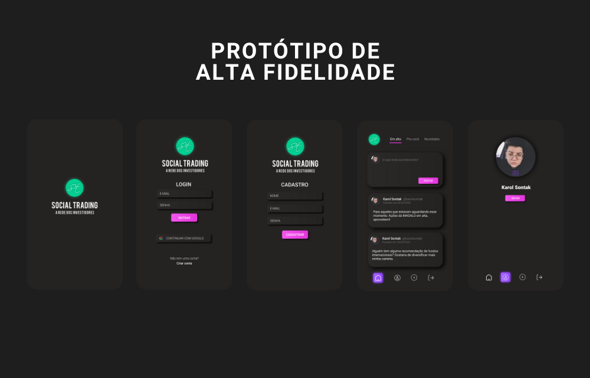

# SOCIAL TRADING - A Rede Social dos Investidores

## Índice

* [1. Prefácio](#1-prefácio)
* [2. Resumo do projeto](#2-resumo-do-projeto)
* [3. Considerações gerais](#3-considerações-gerais)
* [4. Considerações finais](#3-considerações-finais)

***

## 1. Prefácio

A SOCIAL TRADING é uma rede social que tem o intuito de unir em um único lugar 
pessoas que se interessam por investimentos. 
A ideia é que veteranos e iniciantes possam trocar informações e que todos possam
ter acesso a um conteúdo dedicado e específicos para eles.

Aqui você pode acessar nosso projeto: [SOCIAL TRADING](https://suelenescorcio.github.io/SAP007-social-network/)


## 2. Resumo do projeto

Neste projeto construímos uma Rede Social que permite à qualquer usuário criar uma conta de acesso,
logar-se com ela, criar, editar, deletar e dar _likes_ em publicações.

O objetivo principal deste projeto é construir uma [Single-page Application(SPA)] na qual seja possível **ler e escrever dados**.

## 3. Considerações gerais

* A lógica do projeto foi implementada completamente em JavaScript
  (ES6+), HTML e CSS :smiley:. Neste projeto não há uso de _frameworks_ ou bibliotecas de CSS e JS.

### 3.1 Boilerplate

Este projeto inclui um _boilerplate_ contendo estrutura de pastas e testes unitários (_tests_): 

```text
.
├── node_modules
├── src
|  ├── image 
|  ├── pages 
|  |  |  └── about
|  |  |  |   └── about.css
|  |  |  |   └── about.js
|  |  |  └── feed
|  |  |  |   └── feed.css
|  |  |  |   └── feed.js
|  |  |  └── login
|  |  |  |   └── login.css
|  |  |  |   └── login.js
|  |  |  └── register
|  |  |  |   └── register.css
|  |  |  |   └── register.js
|  ├── config.js
|  ├── firebase.js
|  ├── index.html
|  ├── main.js
└── test
   └── data.spec.js
├── package-lock.json
├── package.json
├── README.md

```

### 3.2 Definição do produto

Esse produto tem o intuito de sanar a necessidade de um público alvo específico: OS INVESTIDORES!
A ideia é que essa rede social seja capaz de contruir um ambiente de troca e aprendizagem para 
jovens e/ou experientes investidores, fazendo com que o eles possam se relacionar entre si
e simplificar o caminho e os acessos sobre as multiformas que os investimentos possam ter.

### 3.3 Histórias de usuário

História 1: A página inicial deverá ter botões que intuitivamente orientem o usuário para logar com email e senha, cadastrar novo usuário e login pelo Google. Quando o usuário selecionar “cadastrar”, deverá ser direcionado à uma página onde indicará nome, email e senha. O clique em “entrar” irá direcionar para a página de feed se os campos email e senha estiverem preenchidos corretamente, caso contrário apresentará uma mensagem de erro. Da mesma forma será direcionado à página de feed se o login com google tiver sucesso ou apresentando o erro caso não logue.

História 2: A página de feed terá local para compartilhar textos em forma de post. O usuário deverá ser capaz de poder editar, bem como deletar possíveis posts feitos por ela.

História 3: Os usuários devem poder curtir os posts de outros usuários e poder fazê-lo uma única vez.

* **Critérios de aceitação:** tudo o que deve acontecer para satisfazer as
  necessidades do usuário.

* **Definição de pronto:** todos os aspectos técnicos que devem ser atendidos
  para que, como equipe, saibam que essa história está finalizada e pronta para
  ser publicada. **Todas** suas histórias de usuário (com exceções), devem
  incluir esses aspectos em sua definição de pronto (além de tudo o que precisa
  adicionar):

  - Ser uma SPA.
  - Ser _responsivo_.
  - Receber _code review_ de pelo menos uma parceira de outra equipe.
  - Fazer _tests_ unitários.
  - Fazer testes manuais buscando erros e imperfeições simples.
  - Fazer testes de usabilidade e incorporar o _feedback_ dos usuários como
    melhorias.
  - Fazer deploy do aplicativo e marcar a versão (git tag).

### 3.4 Desenho da Interface de Usuário (protótipo de baixa fidelidade)

Definimos qual seria o fluxo que o usuário seguiria dentro do seu
aplicativo e, com isso, criamos a interface do usuário (UI) que siga este fluxo.



### 3.5 Paleta de cores 

A partir das Histórias de Usuário, Pesquisa de Campo, Definição de Desenho da Interface do Usuário
concluímos que precisaríamos de uma Paleta de Cores que agregasse personalidade ao produto, ajudando
assim o fácil reconhecimento do produto e remetece ao universo dos investimentos.


### 3.5 Protótipo de alta fidelidade

O primeiro resultado que chegamos foi representado através do Protótipo a seguir:



### 3.5 Responsivo

O projeto funciona bem em dispositivos de tela grande (computadores, laptops etc.) e
pequena (_tablets_, telefones celulares etc.). A técnica utilizada foi _`mobile first`_.

### 3.6 Considerações sobre o comportamento da Interface do Usuário (UI)

Essas considerações ajudarão você a escrever as definições de pronto de sua
H.U.:

#### Criação e login de conta de usuário

* _Login_:
  - O usuário pode criar uma conta de acesso ou autenticar-se com conta de
    e-mail e senha e também com uma conta do Google.
* Validações:
  - Somente usuários com contas válidas têm acesso permitido.
  - Não haver usuários repetidos.
  - A conta do usuário deve ser um email válido.
  - O que o usuário digita no campo de senha (_input_) deve ser secreto.
* Comportamento:
  - Quando o formulário de registro ou login é enviado, ele deve ser validado.
  - Se houver erros, mensagens descritivas devem ser exibidas para ajudar o
    usuário.

#### Timeline/linha do tempo

* Validações:
  - Ao publicar, há validação no conteúdo do _input_.
* Comportamento:
  - Ao recarregar o aplicativo, é verificado se o usuário está
    _logado_ antes de exibir o conteúdo,
  - Consegue publicar um _post_.
  - Pode dar e remover _likes_ em uma publicação. Máximo de um por usuário.
  - Visualiza contagem de _likes_.
  - Pode excluir uma postagem específica.
  - Solicitar confirmação antes de excluir um _post_.
  - Ao clicar em editar um _post_, você pode alterar o texto para um _input_ que
    permite editar o texto e salvar as alterações.
  - Ao salvar as alterações, você voltaa ao texto normal, mas com a
    informação editada.
  - Ao recarregar a página, poder ver os textos editados.

### 3.7 Considerações técnicas sobre front-end

* A manipulação do DOM e a lógica estão separada (separação de responsabilidades).
* O aplicativo é um [Single Page Application (SPA)]
* Alterar e persistir dados. Os dados que você adiciona ou modifica persistem por todo o aplicativo.

#### Testes unitários

* Lembre-se de que não há _setup_ de **testes** definido, isso dependerá da
  estrutura do seu projeto. Você não deve esquecer de pensar sobre os testes.
  Eles podem ajudar a definir a estrutura e sua lógica.

* Os testes de unidade devem cobrir no mínimo 70% de _statements_, _functions_,
  _lines_ e _branches_.

## **4. Considerações Finais** 

- [x] O planejamento deste projeto se encontra no [Trello](https://trello.com/b/wEUKUCOX/social-network)
- [x] O repositório deste projeto se encontra no [GitHub](https://github.com/suelenescorcio/SAP007-social-network)
- [x] O deploy deste projeto está hospedado no [GitPages](https://suelenescorcio.github.io/SAP007-social-network/)
- [x] Este projeto foi desenvolvido por [Daiane Oltramari](https://github.com/daianeoltramari), [Karol Sontak](https://github.com/karolsontak) e [Suellen Escórcio](https://github.com/suelenescorcio).

